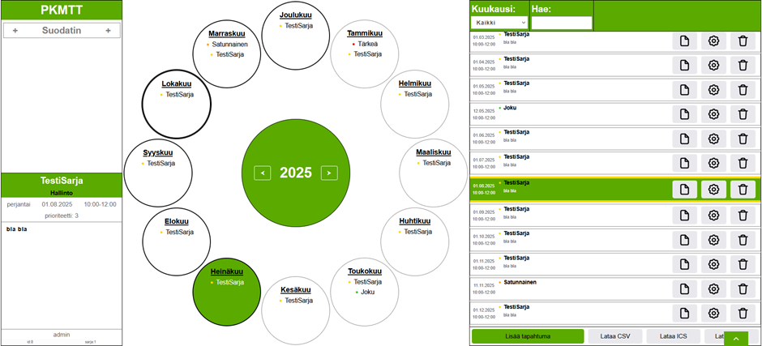
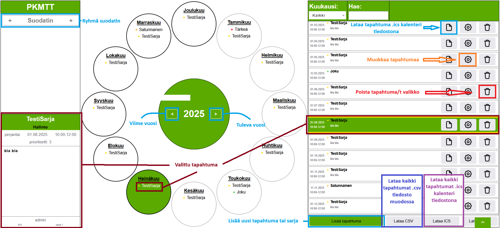

<h1 align="center">Vuosikello - Wordpress plugin</h1>

<h3>info</h3>

<ul>
<li>Luotu organisaation vuoden aikana tapahtuvien tapahtumien hallintaa varten.</li>
<li>Vuosikello on lisäosa Wordpressiin, visuaalinen asiakkaan puoli on pääosin kirjoitettu javascriptillä ja palvelimen toiminallinen puoli phpllä.</li>
<li>Vuosikello on tyylitetty <a href="https://wordpress.org/themes/spicepress/">SpicePress</a> varten(muista poistaa sivupalkit), jos teemaa ei ole tai se vaihdetaan niin main.css vaatii muutoksia vähintään niin että teeman blogi luokan leveys on 100vw ja padding on 0</li>
<li><strong>Tämä lisäosa ei sovellu julkiseen verkkoon!</strong> koska tämä on suunniteltu käytettäväksi sisäisessä verkossa luotettavien ihmisten kesken vuosikellosta puuttuu käyttäjien hallinta, autentikaatio sekä vahva validointi.</li>
</ul>

<h3>asennus</h3>
<ul>
<li><a href="https://codeload.github.com/nesterinen/VuosiKello/zip/refs/heads/main"> Lataa(.zip) </a></li>
<li>Kirjaudu Wordpress sivustoon {esimerkki.com}/wp-admin/</li>
<li>Lisäosat -> Asenna lisäosa -> Lataa lisäosa -> Selaa..</li>
<li>Ladatut tiedostot -> VuosiKello-main.zip</li>
</ul>

lisäosan päivitys toimii täysin tavalla.

<h3>ryhmien päivitys</h3>
<ul>
<li>Kirjaudu Wordpress sivustoon {esimerkki.com}/wp-admin/</li>
<li>Asetukset -> VuosiKello</li>
<li>Lisää: kirjoita ryhmän nimi syöttöön ja paina "lisää"</li>
<li>Poista: paina poistettavan ryhmän nimen viereistä "poista" painiketta</li>
<li>"palauta vakio ryhmät" painike poistaa kaikki nykyiset ryhmät ja lisää automaattisesti vakio ryhmät:     'Hallinto',
    'Työsuojelu',
    'Wörkkis',
    'Jokikievari',
    'Kotikievari',
    'Kouhu',
    'Olohuone Kotoisa'</li>
</ul>

<h3>grafiikan yleiskatsaus</h3>

